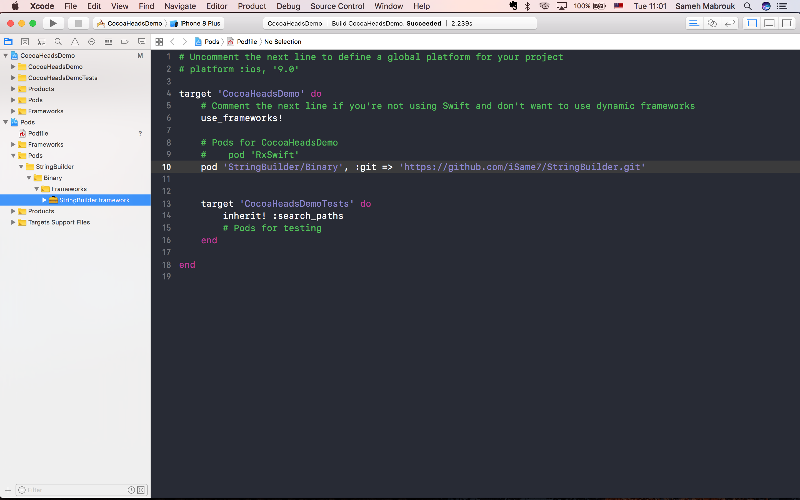

# CocoaPodsAsCarthage
Shell script that make your pod as Dynamic framework 

# What does this script do?:
It enable using a pod as a framework instead of source files in your project. 

it looks like that:

<h3 align="center">
    
    <br />
  </a>
</h3>

# Why?
1- The beauty of this script is that it enable you to switch between using a pod as a framework or as source files. 
2- You might be in a situation that your project is a large scale one and you have a lot of inter dependencies and you don't have the possiblity to switch to Carthage and you want to stick to CocoaPods. 

# How this script works:

```
./automator.sh "Pod name" --SourceAndBinary

e.g:
./automator.sh StringBuilder --SourceAndBinary

```
This what happens when you run this command from terminal:

1- Search for pod name in CocoaPods search enging using CocoaPods API. 
2- Parse JSON comming from CocoPods's API, get repo url and fork this repo using Github API.
3- Parse JSON comming from Github's API, get ssh_url and clone this repo. 
4- Create a framework for targets of cloned repo using Carthage. (you can use Xcode to do that feel free to change the script :)) 
5- Create a directory/folder and add the created framwork inside it. 
6- If you call the script with --SourceAndBinary option like:
```
./automator.sh "Pod name" --SourceAndBinary
```
this will happen:
 - The script will change pod spec by adding two subspecs one that supports Binary "binary.vendored_frameworks" and another one that supports source files "source.source_files".
 
 If you don't call the script without --SourceAndBinary option like:
 ```
./automator.sh "Pod name"
```
 this will happen:
 - The script will add "s.ios.vendored_frameworks" to subbort only framworks. 
 
 7- It Commits and push the changes back to the forked remote repo. 
 
 
 # Dependencies
 
 1- GithubToken: you need to set your github token in the script before running it. 
 2- you need to install jq to parse JSON. 
 ```
 brew install jq
```

# Credits

CocoaPodsAsCarthage is brought to you by  [Sameh Mabrouk](http://isame7.github.io/). You can contact me on:
 
Twitter: [@same7mabrouk](http://twitter.com/same7mabrouk)

LinkedIn: [smabrouk](http://www.linkedin.com/in/smabrouk)
 


